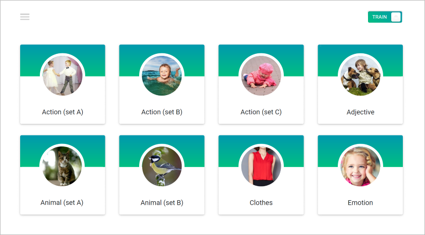

# English for kids

## Цель:

Цель этого задания - создать приложения для изучения английского языка для детей.

[Дизайн в Figma](https://www.figma.com/file/bvNuu9qEw27m2O8kQLeR8O/English-for-kids?node-id=0%3A1)

**ВАЖНО:** Админскую часть на этом этапе делать не требуется! Рекомендую создать свой дизайн, но если уж совсем никак - используйте этот, либо улучшите его.

## Название ветки: `final-project-english-for-kids`

Шаги выполнения домашнего задания:

1. Создайте собственную ветку `final-project-english-for-kids` из ветки `master`
2. Не удаляйте .README файл, а просто добавьте свое короткое описание проекта.
3. Создайте и разверните проект с помощью `npm create vite@latest`
4. Сконфигурируйте Eslint и Prettier в проекте.
5. Выполните задание.
6. Запушьте свою ветку предварительно не забыв добавить и описать коммиты
7. Создайте pull-request в ветку `master` _своего_ репозитория и добавьте `takhanov` в качестве ревьюера (PR не нужно мержить!)
8. **ВАЖНО:** В описание PR добавьте **скриншот запущенного приложения** с выполненным заданием (без скриншота задание не считается сданным)
9. Ссылку на PR (pull-request) добавьте в нужный файл который предоставит Ольга.

## Структура приложения:

1. Главная страница
2. Страница категории
3. Страница статистики

### Demo

https://english-for-kids.netlify.com/ (версия без Hacker scope)

## Примеры работ

- https://marta-r-english-for-kids.netlify.app/
- https://zheromskyv-english-for-kids.netlify.app/
- https://xmelsky-english-for-kids.netlify.app/
- https://irinateln0va-english-for-kids.netlify.app/
- https://kotiknalune-english-for-kids.netlify.app/

## Описание страниц

1. Главная страница приложения

- на главной странице приложения размещаются ссылки на страницы с категориями слов
- минимальное количество категорий - восемь
- каждая ссылка содержит тематическую картинку и название категории
- ссылки дублируются в выезжающем боковом меню, которое открывается и скрывается по клику на иконку в левом верхнем углу страницы
- на главной странице приложения и на страницах категорий есть переключатель Train/Play (тренировка/игра)

2. Страница категории

- страница категории содержит название категории и карточки со словами соответствующей тематики
- минимальное количество карточек со словами в каждой категории - восемь
- каждая карточка содержит тематическую картинку и слово на английском языке
- при клике по карточке звучит произношение слова на английском языке
- на каждой карточке есть кнопка, при клике по которой карточка переворачивается. На оборотной стороне карточки размещается перевод слова. При клике по оборотной стороне карточки ничего не происходит, произношение слова не звучит.
- обратный поворот карточки на лицевую сторону происходит автоматически, когда курсор мыши перемещается за её границы

3. Страница со статистикой

- описание страницы находится в критериях оценивания (Hacker scope)

## Работа приложения

Приложение работает в режиме тренировки и в режиме игры.  
Описание работы приложения в данных режимах находится в критериях оценивания (Basic scope и Advanced scope соответственно).
При загрузке приложения или перезагрузке страницы приложение открывается в режиме тренировки.
Переключение между тренировкой и игрой происходит при клике по переключателю Train/Play.

## Технические требования

- Работа приложения проверяется в браузере Google Chrome последней версии
- можно использовать [bootstrap](https://getbootstrap.com/), [material design](https://material.io/), css-фреймворки, html и css препроцессоры
- Приложение должно быть SPA
- Приложение должно быть написано на React
- Приложение должно ипользовать Firebase для храниния пользовательских данных и статистики
- Приложение должны быть задеплоено на [Netlify](https://www.netlify.com/) либо [Vercel](https://vercel.com/) - туториалы про деплой указаны ниже
- Деплоить нужно именно папку `dist`, которая создается с помощью команды `npm run build` в терминале (вместо `npm run dev`)

## Требования к оформлению приложения

- внешний вид приложения соответствует предложенному образцу или является его улучшенной версией
- вёрстка адаптивная. Минимальная ширина страницы, при которой проверяется корректность отображения приложения, 320рх
- так как приложение предназначено для обучения детей, в том числе и тех, которые ещё не умеют читать, все надписи, если это возможно, необходимо продублировать картинками или иконками
- интерактивность элементов, с которыми пользователи могут взаимодействовать, изменение внешнего вида самого элемента и состояния курсора при наведении, использование разных стилей для активного и неактивного состояния элемента, плавные анимации
- в футере приложения есть ссылка на гитхаб автора, год создания приложения

## Критерии оценки:

**Максимальный балл за задание: 390 баллов**

### Basic scope

- **Вёрстка, дизайн, UI главной страницы приложения:**
  - [ ] **+20** - присутствуют все указанные в задании элементы как на мобильной, так и на десктопной версии
  - [ ] **+20** - выполнены все описанные требования к оформлению приложения
- **Вёрстка, дизайн, UI выезжающего меню:**

  - [ ] **+15** - выполнены все описанные требования к оформлению приложения
  - [ ] **+10** - ссылки в меню рабочие и ведут на страницы с категориями слов
  - [ ] **+10** - ссылка на текущую страницу внешне отличается от остальных
  - [ ] **+10** - выезжающее меню присутствует на всех страницах приложения
  - [ ] **+10** - плавная анимация выезжающего меню
  - [ ] **+10** - меню закрывается кликом по крестику, кликом по ссылке в меню, кликом в любом месте приложения, кроме самого меню

- **Вёрстка, дизайн, UI страницы категории:**

  - [ ] **+10** - присутствуют все указанные в задании элементы как на мобильной, так и на десктопной версии
  - [ ] **+10** - выполнены все описанные требования к оформлению приложения

- **Режим тренировки:**
  - [ ] **+10** - при клике по карточке звучит произношение слова на английском языке: (+10)
  - [ ] **+10** - на каждой карточке есть кнопка, при клике по которой карточка поворачивается, на обратной стороне указан перевод слова. Когда курсор мыши перемещается за границы карточки, она автоматически поворачивается на лицевую сторону: (+10)

Итого: **145**

### Advanced scope

- **Режим игры:**
  - [ ] **+10** - кликом по переключателю Train/Play включается режим игры. В режиме игры указанные выше возможности режима тренировки отключаются, кнопка, при клике по которой карточка переворачивалась, и текст на карточке скрываются. Появляется кнопка "Start game". Размер карточки не изменяется. На карточке остаётся только изображение, которое занимает всю её площадь (если это не противоречит вашему дизайну):
  - [ ] **+10** - после клика по кнопке "Start game" звучит английское произношение рандомного слова из тех, что находятся на странице. Для каждой страницы, и для каждой игры рандомные слова генерируются по-новой:
  - [ ] **+10** - после первого клика по кнопке "Start game" надпись на ней меняется на иконку "Repeat", меняется внешний вид кнопки. При клике по кнопке "Repeat" произношение слова звучит ещё раз:
  - [ ] **+10** - если пользователь кликнул по активной карточке с неправильным ответом, раздаётся звуковой сигнал "error":
  - [ ] **+10** - если пользователь кликнул по активной карточке с правильным ответом, раздаётся звуковой сигнал "correct" и после него звучит произношение рандомного слова из тех, которые ещё не звучали:
  - [ ] **+10** - карточка с угаданным словом становится неактивной, при этом изменяется её внешний вид. Клики по неактивной карточке звуковыми эффектами не сопровождаются, на счёт игры не влияют:
  - [ ] **+10** - после начала игры каждый клик по активной карточке является правильным или неправильным ответом. Эти ответы отображаются в виде звёздочек (или других символов) разного цвета в шкале с рейтингом, которая появляется в режиме игры. Если звёздочек слишком много и шкала заполнена ими полностью, предыдущие звёздочки скрываются, а новые продолжают добавляться:
  - [ ] **+10** - когда угаданы все слова в категории:
    - если все слова угаданы правильно, звучит сигнал "success", карточки со словами скрываются, на странице отображается радостный смайлик (или другая картинка)
    - если при угадывании слов были ошибки, звучит сигнал "failure", карточки со словами скрываются, на странице отображается грустный смайлик (или другая картинка) и количество допущенных ошибок.
    - приложение автоматически перенаправляет на главную страницу со списком категорий

Итого: **80**

### Hacker scope

- **Страница статистики:**

  - [ ] **+20** - страница со статистикой содержит перечень всех категорий, всех слов в каждой категории, перевод каждого слова. Минимальная ширина, при которой страница статистики отображается корректно – 320 рх. Не является ошибкой наличие в таблице со статистикой полосы прокрутки: (+20)
  - [ ] **+10** - возле каждого слова указывается статистика - сколько раз по карточки с данным словом кликали в режиме тренировки, сколько раз данное слово угадывали в режиме игры, сколько ошибок при этом допустили, процент правильных ответов по каждому слову в режиме игры. После перезагрузки приложения статистика сохраняется: (+10)
  - [ ] **+10** - есть возможность сортировки данных по алфавиту, для числовых значений - по их величине. Сортировка может происходить в прямом и обратном порядке и должна охватывать весь диапазон данных: (+10)
  - [ ] **+10** - на странице со статистикой размещены кнопки "Repeat difficult words" и "Reset". Кнопка "Reset" обнуляет статистику. При клике по кнопке "Repeat difficult words" открывается страница изучения слов с наибольшим процентом ошибок аналогичная странице категории. На странице "Repeat difficult words" может размещаться от нуля до восьми слов, в зависимости от того сколько слов угадывалось в режиме игры и при их угадывании были допущены ошибки. После нажатия на кнопку "Reset" количество слов на странице "Repeat difficult words" равно нулю: (+10)

- **Страница аутентификации:**
  - [ ] **+10** - вход в приложение возможен с помощью аутентификации по email и паролю. Присутствует страница регистрации и логина. Данные для аутентификации должны храниться в Firebase. Есть возможность выйти из аккаунта. (+20)
  - [ ] **+20** - для каждого из аккаунтов - хранится своя статистика. (+20)

Итого: **80**

### Выполнены требования к коду

- [ ] **+20** - дублирование кода сведено к минимуму, не используются магические числа, используются осмысленные имена переменных и функций, оптимальный размер функций и т.д.
- [ ] **+20** - подключены и используются webpack, eslint, eslint-config-airbnb-base
- [ ] **+20** - приложение разбито на отдельные модули
- [ ] **+15** - методы и функции не превышают 40 строк
- [ ] **+10** - используются фичи ES6 и выше

Итого: **85**

### Штрафные баллы

- [ ] меньше восьми категорий, меньше восьми слов в каждой категории, данные для двух последних категорий скопированы с демо, а не подготовлены самостоятельно - 10 баллов
- [ ] не выполняются требования к репозиторию, названиям коммитов, описанию Pull Request - до 20 баллов
- [ ] не выполняются требования к коду, игнорируются советы ментора относительно качества кода - до 50 баллов
- [ ] использование jQuery в основном коде приложения - 0 баллов за таск
- [ ] заимствование чужого кода (списывание) - 0 баллов за таск

Запрещено копировать код других студентов, демо, примеров, которые приводятся в задании. Этот запрет касается html, css, js кода. Можно использовать небольшие фрагменты кода со Stack Overflow, других самостоятельно найденных источников в интернете, за исключением github-репозиториев студентов курса. Возле использованного чужого фрагмента кода в комментарии указывается ссылка на источник.

## Материалы

- [Папка с данными](./english-for.kids.data) содержит архив с данными для шести категорий слов (используется американское произношение). Для двух недостающих категорий данные необходимо собрать и подготовить самостоятельно используя ресурсы интернета
- [Темы bootstrap](https://bootswatch.com/)
- [Localstorage](https://learn.javascript.ru/localstorage)
- [React](https://ru.reactjs.org/)
- [Redux](https://redux.js.org/)
- [Redux-toolkit](https://redux-toolkit.js.org/)

### Информационные ресурсы

- [ru.forvo.com](https://ru.forvo.com/) - получить английское произношение слова (предлагается несколько вариантов произношения)
- [dictionary.cambridge.org](https://dictionary.cambridge.org/) - получить английское произношение слова
- [wooordhunt.ru](https://wooordhunt.ru/word/welcome) - получить английское произношение слова
- [Деплой на Vercel](https://youtu.be/3bN1TC_qI0E?si=jXZdCqB0K_1Dqf65) - обучающее видео о том как деплоить на Vercel
- [Деплой на Netlify](https://youtu.be/F4oJagFEGJM?si=b3q5lio4hftMmu_L) - обучающее видео о том как деплоить на Netligy (включить русские субтитры)
