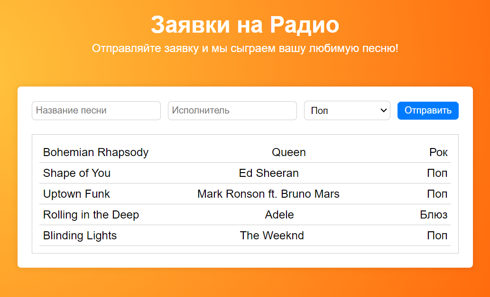

# Приложение: Заявки на Радио

## Цель:

Создать приложение для запросов песен на радио, которое позволит пользователям отправлять заявки на воспроизведение песен. Приложение будет включать форму для ввода деталей песни и отображать список заявленных песен.

Цель этого задания - использовать полученные знания о компонентах, props, state и хендлеров для создания интерактивного приложения с формой и списком.

## Название ветки: `homework-4-radio-songs-app`

Шаги выполнения домашнего задания:

1. Создайте собственную ветку `homework-4-radio-songs-app` из ветки `master`.
2. Не удаляйте .README файл, а просто добавьте свое короткое описание проекта.
3. Создайте и разверните проект с помощью `npx create-react-app radio-songs-app`. В корневой папке не должно быть ничего кроме: папки `radio-songs-app`, файлов `.gitignore` и `README`.
4. Выполните задание.
5. Запушьте свою ветку, предварительно не забыв добавить и описать коммиты.
6. Создайте pull-request в ветку `master` _своего_ репозитория и добавьте `takhanov` в качестве ревьюера (PR не нужно мержить!).
7. **ВАЖНО:** В описание PR добавьте **скриншот запущенного приложения** с выполненным заданием (без скриншота задание не считается сданным).
8. Ссылку на PR (pull-request) добавьте в нужный файл который предоставит Ольга.

## Задание:

1. **Скелет приложения -** У вас уже есть скелет стилизованного приложения с компонентами в папке `App`, который можно использовать для справки.
2. **Разбиение по папкам -** Разнесите код компонентов и стилей по файлам. Правильно импортируйте и настройте его.
3. **Добавить логику -** Оживите приложение, чтобы оно работало согласно описанию. ;) Используйте useState, хендлер функции и получение данных из `event` чтобы переносить данные от дочерних компонентов - родительским. Данные заглушки можете оставить, просто добавляйте туда новые.

Не забывайте следить за структурой файлов и форматированием вашего кода. Используйте соответствующие комментарии, одинаковые отступы и описательные имена компонентов и переменных.

### Дополнительно (необязательно)

- **HACKER LVL -** Если хотите можете написать приложение и все компоненты самостоятельно, без оглядки на готовый код из примера.
- Добавьте функционал для фильтрации песен по жанру.
- Добавьте функциональность для удаления последней песни из списка.
- Можете изменить стили на ваше усмотрение.

## Советы:

- Используйте деструктуризацию в самом аргументе компонентов: `function MyComponent({ title, artist })`
- Cоблюдайте требования к коммита - см. основной README

Удачи!
